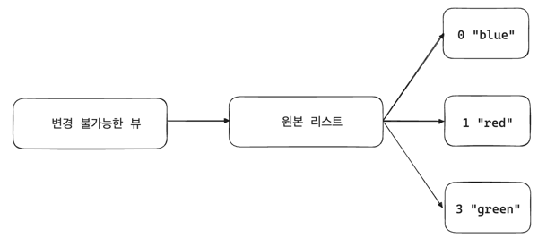
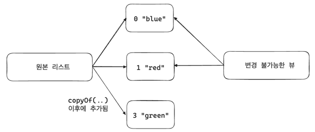

## 자바 불변성 상태

기존 자바는 불변 자료 구조를 제공하지 않았지만 자바 14에서 불변 자료 구조인 레코드가 도입되었다.

### `java.lang.String`
문자열은 어디에서나 사용되기 때문에 String 타입에는 높은 최적화와 안정성이 필요한데 그 최적화 방법으로 불변성이 있다.

String은 int, char같은 원시 타입이 아니지만 +(더하기) 연산이 가능해 문자열끼리 연결할 수 있다. 이 때 실제로 문자열의 값이 바뀌는 거싱 아닌 새로운 String 객체를 생성하는 것이다.
- 지속적으로 문자열 연결을 사용하면 메모리의 힙 영역에 계속 String 인스턴스가 생성되어 메모리를 차지하므로 지양해야 한다.
- JVM은 필요 없어진 인스턴ㄴ스를 가비지 컬렉션을 통해 정리하지만, 계속 생성되는 String 객체로 인한 메모리 오버헤드는 실제 런타임에 부담이 될 수 있다.

따라서 JVM은 문자열 연결을 `java.lang.String Builder`로 대체하거나 `invodedynamic` 명령 코드를 활용하는 등 여러 최적화 전략을 내부적으로 사용한다.

**JVM의 문자열 리터럴(큰 따옴표(")로 둘러싸인 문자열) 관리**
자바에서는 문자열 리터럴을 사용할 때 JVM 내부적으로 문자열 풀링(string pool)이라는 메커니즘을 이용해 문자열 리터럴을 관리한다. 문자열 풀링은 동일한 내용의 문자열 리터럴이 여러 번 사용되더라도 메모리를 절약하기 위해 하나의 인스턴스만 유지한다.

- 문자열 풀링 덕분에 동일한 리터럴은 한번만 저장되어 재사용되어 힙 메모리 공간 절약에 도움이 된다. 
- 만약 문자열이 변경된다면 풀에서 해당 문자열을 참조하는 모든 곳에 영향을 줄 수 있다.
- 리터럴을 생성하는 대신 명시적으로 생성자 중 하나를 호출해 새로운 String을 할당하는 것으로 풀링을 우회할 수 있다. 
- 반대로 인스턴스에서 intern 메서드로 문자열 풀에서 동일한 내용의 문자열을 반환할 수도 있다.
    ```java
    String str1 = new String("Hello").intern(); // 문자열 풀에 추가 후 참조 반환
    String str2 = "Hello";
    
    System.out.println(str1 == str2); // true (풀에서 동일한 문자열 참조)
    ```

> 이러한 특수 관리로 인해 String 문자열을 비교할 때 동등성 연산자 '=='를 사용하면 안되고 equals 또는 equalsIgnoreCase를 사용해 동등성 비교를 해야한다.
```java
String str1 = "Hello";
String str2 = "Hello";
String str3 = new String("Hello");

System.out.println(str1 == str2); // true (같은 리터럴)
System.out.println(str1 == str3); // false (새로운 객체 생성)
System.out.println(str1.equals(str3)); // true (내용 비교)
```

하지만 String 타입은 완전히 불변하지는 않다. 성능 문제로 인해 String은 전체 문자열을 읽어야 하기 때문에 hashCode를 지연해서 계산한다. 
- 그래도 여전히 순수한 함수로 동일한 String은 항상 동일한 hashCode를 생성한다.


### 불변 컬렉션
자바의 컬렉션 프레임워크는 불변성을 중심으로 설계되지는 않았지만 3가지 방법으로 불변성을 제공한다.
1. 변경 불가능한 컬렉션
2. 불변 컬렉션 팩토리 메서드
3. 불변 복제

이 옵션들은 `new` 키워드를 사용해 직접 인스턴스화할 수 있는 pulbic 타입은 아니지만 필요한 인스턴스를 생성하기 위한 정적 편의 메서드를 제공한다.
- 얕은 불변성을 가지고 있어 최상위 계층에서만 불변성을 유지하고 요소 자체의 불변성은 보장하지 않는다. 즉, 자료 구조 자체의 참조는 변경되지 않지만 참조된 자료 구조의 요소들은 변경될 수 있다. 


### **1. 변경 불가능한 컬렉션**
`java.util.Collections` 클래스의 일반 정적 메서드 중 하나를 호출해 기존 컬렉션에서 생성한다.
```java
Collection<T> unmodifiableCollection(Collection<? extends T> c)

Set<T> unmodifiableSet(Set<? extends T> s)

List<T> unmodifiableList(List<? extends T> list)

Map<K, V> unmodifiableMap(Map<? extends K, ? extends V> m)

// ...
```

각 메서드는 인수로 받은 타입과 같은 타입을 반환한다. 기존 원본 인스턴스와 반환된 인스턴스의 차이는 반환된 인스턴스를 수정하면 `UnsupportedOperationException`이 발생한다는 점이다.
```java
List<String> modifiable = new ArrayList<>();
modifiable.add("blue");
modifiable.add("red");

List<String> unmodifiable = Collections.unmodifiableList(modifiable);
unmodifiable.clear();  // UnsupportedOperationException 발생
```

변경 불가능한 뷰의 명백한 단점은 기존 컬렉션에 대한 추상화에 불과하다는 점이다. 따라서 기존 컬렉션은 여전히 변경될 수 있으며 변경 불가능한 뷰에 영향을 끼친다.
```java
List<String> original = new ArrayList<>();
original.add("blue");
original.add("red");

List<String> unmodifiable = Collections.unmodifiableList(original);

// unmodifiable을 통해 변경 불가능한 뷰를 얻었지만, 이는 단지 원본 original의 추상화일 뿐이며, 실제로는 original 컬렉션 자체가 수정된다.
original.add("green");

// original 컬렉션이 "blue", "red", "green" 세 개의 요소를 포함하고 있고 변경 불가능한 뷰는 그 변경 사항을 반영한다. 따라서 출력은 3
System.out.println(unmodifiable.size());   
```



> 변경 불가능한 뷰는 주로 반환값으로 사용될 컬렉션에 대해 원치않는 변경을 막기 위해 사용한다.


### **2. 불변 컬렉션 팩토리 메서드**
자바 9부터 도입된 기능으로 기존 컬렉션을 기반으로 하지 않고 원하는 요소들을 직접 해당 컬렉션 타입의 정적 편의 메서드를 통해 직접 전달하는 방법이다.
```java
List<E> of(E e1, ...)

Set<E> of(E e1, ...)

Map<K, V> of(K k1, V v1, ...)
```

> 각 팩토리 메서드는 0개 이상의 요소를 받아들일 수 있으며 제공된 요소의 개수에 따라 최적의 내부 컬렉션 타입을 사용한다. 


### **3. 불변 복제**
자바 10부터 도입된 기능으로 3가지 유형의 static 메서드 `copyOf`를 호출해 더 깊은 수준의 불변성을 제공한다.
```java
Set<E> copyOf(Collection<? extends E> coll)

List<E> copyOf(Collection<? extends E> coll)

Map<K, V> copyOf(Map<? extends K, ? extends V> map)
```

`coptyOf` 메서드는 단순히 뷰를 제공하는 것이 아닌 새로운 컨테이너를 생성해 요소들의 참조를 독립적으로 유지한다.

```java
// 원본 리스트
List<String> original = new ArrayList<>();
original.add("blue");
original.add("red");

// 복사본 생성
List<String> copiedList = List.copyOf(original);

// 원본 리스트에 새 항목 추가
original.add("green");

// 복사본에 새 항목 추가 시 불변이므로 에러 발생
copiedList.add("green");    // UnsupportedOperationException 에러 발생


        System.out.println(original);       // [blue, red, green]

System.out.println(copiedList);     // [blue, red]
```



> 불변 컬렉션의 3가지 옵션 중 상황에 따라 선택해야 한다. for 루프처럼 한 번의 호출로 모든 컬렉션을 생성하기 어려운 경우, 변경 불가능한 뷰나 불변 복제가 편할 수 있다.


### 원시 타입과 원시 래퍼
자바의 원시 타입의 경우 객체와는 다르게 불변의 특성을 갖는다. 또한 Byte나 Integer 같은 객체 래퍼 타입도 제공하는데 래퍼 타입들은 원시 타입을 구체적인 객체 타입으로 캡슐화해 제네릭처럼 원시 타입이 아직 허용되지 않는 경우에도 사용할 수 있도록 한다.
> 이렇게 하지 않으면 객체 래퍼 타입과 그에 해당하는 원시 타입 간의 자동 변환인 오토박싱이 예측하기 어려운 동작을 유발하게 된다.


### 불변 수학
대부분의 간단한 계산은 int와 같은 원시 타입을 사용해 계산한다. java.math 패키지에는 정수와 소수점 계산을 더 안전하고 정확하게 처리하기 위한 `java.math.BigInteger`와 `java.math.BigDemical` 불변 클래스가 제공된다.

```java
var theAnswer = new BigDecimal(42);

var result = theAnswer.add(BigDecimal.ONE);

System.out.println(result);     // 출력: 43

System.out.println(theAnswer);  // 출력: 42 -> 원본값 변함 없음
```

불변 수학 타입은 오버헤드를 동반하지만 높은 정밀도를 제공한다. 
- 계산 속도가 제한 조건이 아니고 정밀도가 중요할 경우 사용
- BigDecimal의 정수 버전인 BigInteger는 int의 범위인 -2^31 ~ 2^31보다 훨씬 넓은 범위를 제공한다.


### 자바 시간 API (JSR-310)
자바 8부터는 불변성을 핵심 원칙으로 하는 자바 시간 API(JSR-310)이 'java.time' 패키지를 통해 제공된다. 그 전에는 `java.util` 패키지의 `Date`, `Calendar`, `TimeZone` 3가지 타입만 사용했고, 이를 사용한 계산은 번거롭고 오류가 발생하기 쉬웠다.

불변 수학과 마찬가지로 plus나 minus같은 메서드로 수행되는 모든 계산은 호출된 원본 객체에 영향을 미치지 않으므로 반환값을 사용해야 한다.

### enum
자바 열겨형 enum은 상수로 구성된 특별한 타입으로 불변성을 가진다. 상숫값 이외에도 필드가 추가로 포함될 수 있는데 일반적으로 final 또는 String이 사용되지만 가변 객체 타입이나 setter를 사용할 수도 있긴 하다. 
> 하지만 사용하지 말자. 코드 품질에 대한 코드 스멜로 간주됨. 냄시~~


### final 키워드
**final의 효과**
- final 클래스는 하위 클래스화될 수 없다.
- final 메서드는 오버라이딩될 수 없다.
- final 필드는 생성자 내부에나 선언될 때 정확히 한 번 할당되어야 하며 재할당될 수 없다.
- final 변수 참조는 필드처럼 동작하며 선언 시에 정확히 한 번 할당될 수 있다.
  - 참조 자체에만 영향을 미치고 참조된 변수의 내용에는 영향을 주지 않는다.

final 키워드는 필드와 변수에 불변성을 부여한다. 하지만 참조 자체는 불변이 되더라도 기저 자료 구조는 불변하지 않다. 즉, 참조를 재할당할 수 없지만 자료구조는 여전히 변경 가능하다.
```java
// final은 실제 참조하는 ArrayList가 아닌 fruits에만 영향을 미친다.
final List<String> fruits = new ArrayList<>();

System.out.println(fruits.isEmpty());   // true

fruits.add("Apple");    // final이더라도 자료 구조인 ArrayList가 불변성이 아니므로 요소 추가 가능
System.out.println(fruits.isEmpty());   // false

// 컴파일 에러
fruits = List.of("Mango", "Melon"); // final에 의해 재할당 금지됨
```

> 람다 표현식에는 effectively final인 참조가 필요하다. final을 사용하더라도 자료 구조가 변경될 수 있기 때문에 완전히 보장하려면 처음부터 불변 자료 구조를 선택해야 한다. 이를 위해 자바의 레코드를 사용한다.


### 레코드
자바 14에 출시된 레코드는 POJO와 JavaBean을 보완하고 특정 상황에 대체할 수 있는 새로운 클래스 타입이다.

```java
public record Address(String name,
                      String street,
                      String state,
                      String zipCode,
                      Country country) {
    // 바디 ..
}
```
레코드는 주로 상태 선언으로 구성된 얕은 불변성을 가진 데이터 운반체로 추가 코드가 없이도 컴포넌트에 대한 자동으로 생성된 `getter`, `toString`, 동등성 비교 및 `hashCode` 메서드 등을 제공한다.