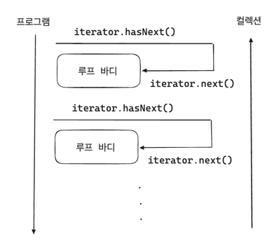
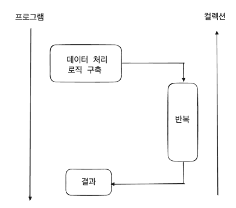

## 반복을 통한 데이터 처리

---

### 외부 반복
**for-loop를 활용한 전통적인 반복**
- 반복 기반 루프에 필요한 보일러플레이트 코드의 양이 명확한 단점
```java
record Book (String title, int year, Genre genre) { }
    
List<Book> books = ...;  // 정렬되지 않은 책 리스트

// 책 제목을 기준으로 정렬
Collections.sort(books, Comparator.comparing(Book::title));

// for-loop
List<String> result = new ArrayList<>();

// 조건에 맞는 책 제목 3개 추출
for (var book : books) {
    if (book.year >= 1970) continue;
    if (book.genre() != Genre.SCIENCE_FICTION) continue;
    
    var title = book.title();
    result.add(title);
    
    if (result.size() == 3) break;
}
```

근본적인 원인은 '무엇을 하느냐(데이터 처리)'와 '어떻게 수행하는가(요소를 반복)'을 혼용하는 것에 있다. 이러한 경우를 외부 반복이라고 하고 for-loop의 변형인 for-each를 통해 `java.util.Iterator<E>`를 사용해 컬렉션을 수행한다. 
- `hasNext`와 `next` 호출을 통해 반복을 제어



위의 예제를 보면 데이터 처리를 위한 코드는 단 2줄이지만 반복 순회를 관리하는 데 더 많은 코드 라인이 소요된다.

> 외부 반복의 또 다른 단점으로는 병렬 데이터 처리가 필요한 경우 전체 루프 구조를 재작성해야 하며 그 과정에서 `ConcurrentModificationException`과 같은 복잡한 문제들을 해결해야 한다는 점이다.

---

### 내부 반복
외부 반복의 반대 접근법으로 개발자가 순회 과정을 직접 제어하는 것을 포기하고 데이터 소스 자체가 '어떻게 수행되는지'를 담당하도록 한다.



순회를 직접 제어하기 위해 반복자(iterator)를 사용하는 대신 데이터 처리 로직은 스스로 반복을 수행하는 파이프라인을 사전에 구성한다. 
- 반복 과정이 불투명해지지만 로직이 어떤 요소들이 파이프라인을 순회하는지에 영향을 준다.
- 이를 통해 '무엇을 하고 싶은지'에 집중할 수 있다.
- 스트림은 내부 반복을 가진 데이터 파이프라인의 예시이다.