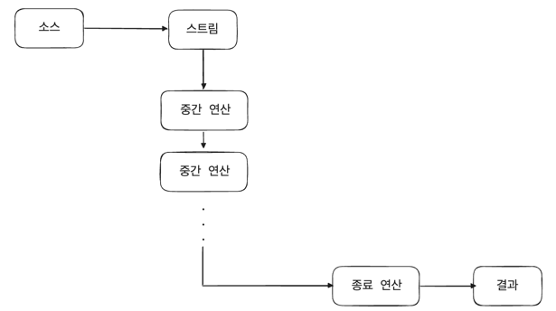
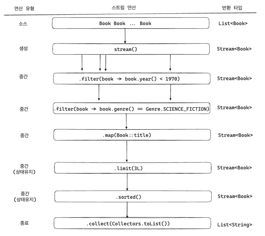

## 함수형 데이터 파이프라인으로써의 스트림

---

스트림의 내부 반복자는 함수형 관점에서 많은 장점을 가진다.
1. 선언적 접근법
   - 단일 호출 체인을 통해 간결하고 명료하게 다단계 데이터 파이프라인을 구축한다.
2. 조합성
   - 스트림의 연산들은 데이터 처리 로직을 위한 고차 함수로 이루어져 있으며 필요에 따라 조합해서 사용할 수 있다.
3. 지연 처리
   - 모든 요소를 일일히 순회하는 대신, 마지막 연산이 파이프라인에 연결된 이후에 각 요소가 하나씩 순차적으로 파이프라인을 통해 처리된다.
4. 성능 최적화
   - 스트림은 데이터 소스와 사용된 연산의 종류에 따라 순회 방식을 자동으로 최적화한다.
5. 병렬 데이터 처리
   - 내장된 병렬 처리 기능을 사용해 호출 체인에서 단일 호출을 간단히 변경할 수 있다. 

스트림의 전반적인 작업 흐름은 느긋한 순차 데이터 파이프라인으로 설명된다. 이러한 파이프라인은 연속된 고차 함수로 구성되어 있으며 함수적인 방식으로 각 요소를 처리한다.


1. 스트림 생성
   - 가장 먼저 기존의 데이터 소스에서 스트램 생성
   - 스트림은 컬렉션과 같은 특정된 타입에만 국한되는 것이 아닌 연속적인 요소를 제공할 수 있다면 어떤 소스라도 스트림으로 변환할 수 있다.
2. 연산 수행
   - 중간 연산: `java.util.stream.Stream<T>` 메서드로 제공되는 고차 함수들
   - 파이프라인을 통과하는 요소들을 대상으로 필터링, 매핑, 정렬 등 작업 수행
   - 각 연산은 새로운 스트림을 반환하며 원하는 만큼 중간 연산을 실행할 수 있다.
3. 결과 얻기
   - 데이터 처리 파이프라인을 완료하기 위해 스트림 대신 결과를 반환하는 마지막 종료 연산이 필요하다.
   - 스트림 파이프라인 설계를 완료하고 실제 데이터 처리를 시작한다. 


**이전의 책 제목 찾기 예제를 스트림 파이프라인을 사용해 리팩토링 해보자**
```java
List<Book> books = ...;

List<String> result =
    books.stream()
        .filter(book -> book.year < 1970)
        .filter(book -> book.genre() == Genre.SCIENCE_FICTION)
        .map(Book::title)
        .sorted()
        .limit(3L)
        .collect(Collectors.toList());
```

- 스트림 파이프라인 흐름


> 데이터를 미리 준비하거나 루프문의 바디에 처리 로직을 래핑할 필요 없이 여러 처리 단계를 체이닝한 클래스로 구성된다.  

---

### 스트림의 특성

**느긋한 계산법**
- 스트림에서 중간 연산을 수행할 때 즉각적으로 실행되지 않는다.
- 스트림 파이프라인은 모든 연산을 모아놓고, 종료 연산을 호출하기 전까지 아무런 작업도 시작하지 않는다.
- 스트림은 루프처럼 모든 요소를 코드 블록에 바로 제공하지 않는다.
- 모든 요소가 각 연산을 거치는 거싱 아닌 필요한 만큼의 데이터만 거치도록 할 수 있다.
- 스트림 요소의 흐름은 깊이 우선(depth-first) 방식을 따르며 필요한 CPU 주기, 메모리 사용량, 스택의 깊이를 줄일 수 있다.

**(대부분) 상태 및 간섭 없음**
- 스트림은 함수형 프로그래밍의 변경 불변한 상태 원칙을 따른다.
- 중간 연산의 대부분은 상태를 갖지 않고 파이프라인의 다른 부분과 독립적으로 작동해 현재 처리 중인 요소에만 접근한다.
- but, `limit`나 `skip`과 같은 특별한 중간 연산의 경우 어느 정도 상태 값을 관리해야 한다.
- 데이터 소스와 요소들이 분리되어 있어 연산들은 소스 데이터에 어떠한 방식으로도 영향을 주지 않으며 스트림 자체도 어떠한 요소를 저장하지 않는다.
- 간섭하지 않고 통과하는 느낌

**최적화**
- 스트림의 내부 반복 및 고차 함수의 기본적인 설계는 스트림 자체를 매우 효율적으로 최적화한다.
- 스트림의 성능 향상 전략
  - (무상태의) 연산 융합
  - 불필요한 연산 제거
  - 단축 파이프라인 경로

> 스트림은 사용하는 데 비용이 드는 일반적인 타입이다. 여전히 데이터 소스를 래핑해야 하며 파이프라인은 각 호출마다 새로운 스택 프레임을 필요로 한다. 하지만 대부분의 실제 상황에서는 for와 while과 비교했을 때 스트림의 이러한 오버헤드의 단점을 초월하는 장점이 있다.

**보일러플레이트 최소화**
- 스트림은 데이터 처리를 하나의 유연한 메서드 호출 체인으로 단순화하기 때문에 복잡성을 명료하고 표현력 있게 풀어낸다.

**재사용 불가능**
- 스트림 파이프라인은 단 한 번만 사용할 수 있다.
  - 다시 사용하려고 할 경우 `IllegalStateException`이 발생한다.
- 스트림 파이프라인은 데이터 소스에 연결되어 있으며 종료 연산이 호출된 후 정확히 한 번만 전달된다.
- 스트림이 소스 데이터에 영향을 주는 것이 아니기 때문에 항상 동일한 소스 데이터로부터 다른 스트림을 생성할 수 있다.

**원시 스트림**
- 스트림 API는 원시 타입 처리에 특수화된 변형을 통해 오토박싱 오버헤드를 줄인다.
  - 스트림과 그 변형(`IntStream`, `LongStream`, `DoubleStream`)들은 모두 `BaseStream`이라는 기본 인터페이스를 기반으로 한다.

**쉬운 병렬화**
- 전통적인 루프 구조로 동시성을 처리하기 어렵다. 
- 스트림은 처음부터 병렬 실행을 지원하도록 설계되었고, 파이프라인 내에서 단순히 `parallel` 메서드를 호출하는 것으로 가능하다.
  - but, 모든 스트림 파이프라인이 병렬 처리에 적합한 것은 아니며 스트림 원본은 충분한 데이터를 포함하고 있어야 하고, 연산이 여러 스레드의 오버헤드를 수용할 만큼의 비용을 감당할 수 있어야 한다.
  - 스레드를 전환하는 것, 즉 컨텍스트 스위치는 상당한 비용이 드는 작업이다.

**예외 처리의 한계**
- `try-catch` 보다 간결하게 예외 처리를 다룰 수는 없다..

---

### 스트림의 핵심, `Spliterator`
전통적인 for-each 루프에서 Iterator<T> 타입을 기반으로 요소들을 순회하는 것처럼 스트림도 자체적인 반복 인터페이스인 `java.util.Spliterator<T>`를 사용한다.
- `Iterator`는 '다음'이라는 개념에 집중하기 대문에 자바의 Collection API 범용 반복자로 사용된다.
  - 반면 `Spliterator`는 특정 특성을 기반으로 요소의 일부를 다른 `Spliterator`로 분리할 수 있어서 부분적인 시퀀스들을 병렬로 처리하면서도 자바의 Collection API 타입을 순회할 수 있다.

**`java.uril.Spliterator`의 특성**
```java
public interface Spliterator<T> {
    // 특성
    int characteristics();
    default boolean hasCharacteristics(int characteristics) {
        // ..
    }
    
    // 반복
    boolean tryAdvance(Consumer<? super T> action);
    default void forEachRemaining(Consumer<? super T> action) {
        // ..
    }
    
    // 스플릿
    Spliterator<T> trySplit();
    
    // 크기
    long estimateSize();
    default long getExactSizeIfKnown() {
        // ..
    }
    
    // 비교
    default Comparator<? super T> getComparator() {
        // ..
    }
}
```

**`Spliterator`의 특성**

`Spliterator` 타입에는 8개의 결합 가능한 특성이 static int 상수로 정의되어 있다.
- 스트림의 특성은 고정되지 않아도 되며 기본 데이터 소스에 따라 달라질 수 있다. 

| 특성                    | 설명                                                        |
|-----------------------|-----------------------------------------------------------|
| 동시성 <br/>(CONCURRENT) | 기본 데이터 소스는 순회중에 안전하게 동시 수정이 가능하다. <br/>오직 데이터 소스 자체에만 영향을 미치며 스트림 동작에는 영향을 주지 않는다. |
| 고유성<br/>(DISTINCT)    | 데이터 소스에는 `Set<E>`처럼 고유한 요소만 포함한다.<br/>스트림 내의 모든 요소 쌍은 `x.equals(y) == false`가 보장된다. |
| 불변성 <br/>(IMMUTABLE)  | 데이터 소스 자체는 변경 불가능<br/>순회 중에는 어떠한 요소도 추가, 수정 제거될 수 없다.<br/>오직 데이터 소스 자체에만 영향을 미치며 스트림의 동작에는 영향을 주지 않는다. |
| 널 아님  <br/>(NONNULL)  | 기본 데이터 소스는 `null` 값을 포함하지 않는다는 것을 보장한다.<br/>오직 데이터 소스 자체에만 영향을 미친다. |
| 순서<br/>(ORDERED)      | 데이터 소스의 요소에는 약속된 순서가 있다.<br/>순회 중 만난 요소는 특정 순서대로 정렬된다.    |
| 크기<br/>(SIZED)        | 데이터 소스는 정확한 크기를 알고 있다.<br/>`estimateSize()` 메서드는 추정치가 아닌 실제 크기를 반환한다. |
| 부분 크기<br/>(SUBSIZED)  | `trySplit()` 호출 후에 분할되는 모든 `Spliterator`는 `SIZED`의 특성을 갖는 |

**HashSet은 동적 특성을 가진 Spliterator의 예시**
- `HashSet`은 내부적으로 `HashMap`을 사용해 요소를 저장하며, `HashMap.KeySpliterator` 내부 클래스를 통해 `Spliterator`를 생성한다.

> 스트림의 특성에 대해 크게 고민할 필요는 없다. 데이터 소스의 기본적인 기능들은 대부분 스트림을 순회하더라도 갑자기 변하지는 않는다.

> 스트림을 활용할 때 `Spliterator`를 직접 만들 필요는 없다. 곧 배울 메서드들이 백그라운드에서 이를 대신 처리해줄 것이다. 