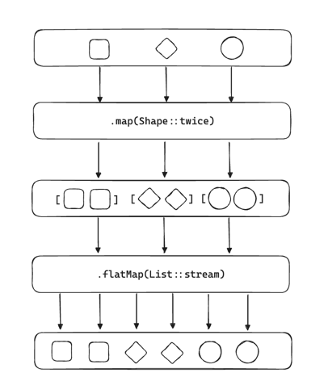
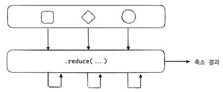
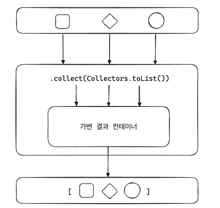
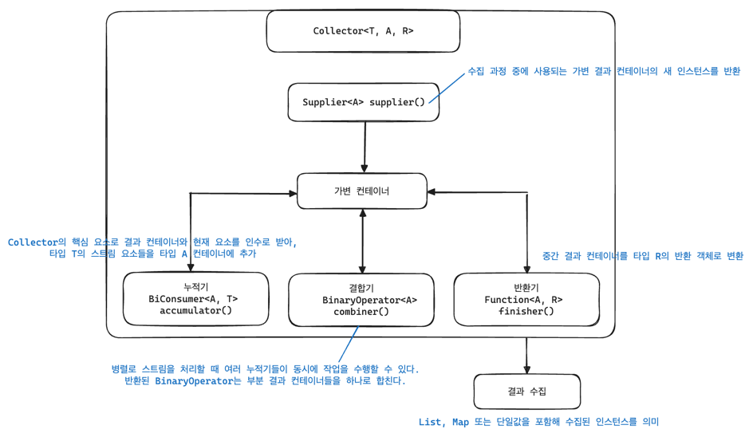

## 스트림 파이프라인 구축하기

대부분의 데이터 처리는 동일한 체계를 따르며 3가지 연산 유형으로 나뉜다.
1. map: 데이터 변환
2. filter: 데이터 선택
3. reduce: 결과 도출

3가지 전부 Collection 타입에서 쉽게 사용할 수 있는 함수이다. map/filter/reduce 패턴은 요소의 연속을 하나의 단위로 취급하기 때문에 함수의 조합으로 더 큰 연산 체인을 만들어냄으로써 내부 반복을 활용해 제어문을 제거할 수 있게 한다.

> 모든 단일 스트림 연산은 3가지 유형 중 하나에 속한다.

---

### 스트림 생성하기
스트림 파이프라인은 기존의 데이터 소스로부터(ex: Collection) 새로운 스트림 인스턴스를 생성한다.

**JAVA8에서 Collection에 추가된 메서드 3가지**
```java
public interface Collection<E> extends Iterable<E> {
    
    // 새로운 스트림 인스턴스를 생성하는 가장 간단한 방법
    default Stream<E> stream() {
        return StreamSupport.stream(spliterator(), false);
    }

    default Stream<E> parallelStream() {
        return StreamSupport.stream(spliterator(), true);
    }
    
    @Override
    default Spliterator<E> spliterator() {
        return Spliterators.spliterator(this, 0);
    }
    
    // ..
}
```

---

### 스트림 실습

**실습에 사용할 Shape**
```java
public record Shape(int corners) implements Comparable<Shape> {
    
    // 헬퍼 메서드
    
    public boolean hasCorners() {
        return corners() > 0;
    }
    
    public List<Shape> twice() {
        return List.of(this, this);
    }
    
    @Override
    public int compareTo(Shape o) {
        return Integer.compare(corners(), o.corners());
    }
    
    // 팩토리 메서드
    
    public static Shape circle() {
        return new Shape(0);
    }

    public static Shape triangle() {
        return new Shape(3);
    }

    public static Shape square() {
        return new Shape(4);
    }
}
```

### 요소 선택

특정 조건에 따라 요소를 선택해야 하는데 Predicate를 이용한 필터링 혹은 요소의 개수를 기반으로 선택함으로써 이뤄진다. 

```java
Stream filter(Predicate<? super T> predicate)
```
- `Predicate`의 결과가 `true`일 경우 해당 요소는 후속 처리를 위해 선택된다.


**Predicate.not(Predicate<? super T> target)**
- 이 정적 메서드는 메서드 참조의 장점을 유지하면서도 Predicate를 쉽게 부정(반대로)할 수 있게 도와준다.
```java
List<Integer> numbers = Arrays.asList(1, 2, 3, 4, 5, 6);
List<Integer> oddNumbers = numbers.stream()
                                  .filter(Predicate.not(n -> n % 2 == 0))
                                  .collect(Collectors.toList());

```

`java.util.Objects` 클래스를 통해 제공되는 null 검사와 같은 기본 작업들은 메서드 참조 형태로 활용할 수 있다.
```java
List<String> strings = Arrays.asList("a", null, "b", null, "c");
List<String> nonNullStrings = strings.stream()
                                     .filter(Objects::nonNull)
                                     .collect(Collectors.toList());

```

---

```java
Stream dropWhile(Predicate<? super T> predicate)
```
- `Predicate`가 `true`가 될 때까지 통과하는 모든 요소를 폐기한다.
- ORDERED(순서가 정해진) 스트림을 위해 설계되었다.
  - 만약 ORDERED 상태가 아니라면 제거된 요소들이 결정론적이지 않을 것이다. 

---

```java
Stream takeWile(Predicate<? super T> predicate)
```
- `dropWhile`의 반대 개념으로 `Predicate`가 `false`가 될 때가지 요소를 선택한다.

---

```java
Stream limit(long maxSize)
```
- 연산을 통과하는 요소의 최대 개수를 `maxSize`로 제한한다.

---

```java
Stream<T> skip (long n)
```
- limit의 반대 개념으로 앞에서부터 n개의 요소를 건너뛰고 나머지 요소들을 다음 스트림 연산으로 전달한다.

---

```java
Stream<T> distinct()
```
- `Object#equals(Object)`를 통해 요소들을 비교하며 중복되지 않은 요소만 반환한다.
- 요소를 비교하기 위해 모든 요소를 버퍼에 저장한다.
- 중복 여부를 판단하기 위한 커스텀 `Comparator<T>`를 제공하는 별도의 내장된 기능은 존재하지 않는다. 

---

```java
Stream<T> sorted()
```
- 요소들이 `java.util.Comparable`에 부합하는 경우 자연스럽게 정렬된다.
- 그렇지 않을 경우 스트림 사용 시 `java.lang.ClassCastException`이 발생한다.
- 요소들을 정렬하기 위해 모든 요소를 버퍼에 저장해야 한다.

> `Comparable`을 구현하는 클래스들
> 1. 기본 자료형 래퍼 클래스: Integer, Long, Double, ...
> 2. 문자 및 문자열 관련 클래스: String
> 3. 날짜 및 시간 관련 클래스

---

```java
Stream<T> sorted(Comparator<? super T> comparator)
```
- `sorted` 메서드는 사용자 정의 `comparator`를 사용해 더 유연하게 정렬 가능하다.
```java
// Comparable을 구현 안 하는 클래스의 경우
class NonComparable {
    private String value;
    
    // 생성자, toSTring, getter()

    public String getValue() {
        return value;
    }
}

// Comparator를 사용해 value 필드를 기준으로 정렬
List<NonComparable> sortedList = list.stream()
            .sorted(Comparator.comparing(NonComparable::getValue))
            .collect(Collectors.toList());
```

---

### 요소 매핑
초기 스트림은 매핑 작업을 2가지만 지원했다.

```java
Stream<R> map(Function<? super T, ? extends R> mapper)
```
- mapper(`Function`) 함수가 요소에 적용되고 새로운 요소가 스트림으로 반환된다.

---

```java
Stream<R> flatMap(Function<? super T, ? extends Stream<? extends R>> mapper)
```



- `Function<? super T, ? extends Stream<? extends R>> mapper`는 새로운 요소를 반환하는 대신 `Stream<R>`을 반환해야 한다. 
- 컬렉션 또는 `Optional`과 같은 컨테이너 형태의 요소를 펼쳐서 새로운 다중 요소를 포함하는 새로운 스트림으로 만든다.

---

```java
Stream mapMulti(BiConsumer<? super T, ? super Consumer<R>> mapper)
```
- `mapMulti` 연산은 매퍼가 스트림 인스턴스를 반환할 필요가 없다.
- 대신 `Consumer<R>`가 요소를 스트림을 통해 더 아래로 전달한다.

**flatMap vs mapMulti**
```java
// flatMap
Stream<Share> flatMap = Stream.of(Shape.square(), Shape.triangle(), Shape.circle())
        .map(Shape::twice)
        .flatMap(List::stream);

// mapMulti
Stream<Shape> mapMulti = Stream.of(Shape.square(), Shape.triangle(), Shape.circle())
        .mapMulti((shape, downstream) -> shape.twice()
            .forEach(downstream::accept))
```
- `Shape` 예제의 경우 flapMap이 더 간결하지만 multiMap의 장점은 map과 flatMap 두 연산을 하나로 압축한다는 점이다.
- mapMulti의 기본 구현에서 실제로 새로운 스트림을 생성하기 위해 flatMap을 사용한다.
- 따라서 매핑된 요소들은 스트림을 어떻게 생성하는지 알 필요가 없다.
- 다운스트림 Consumer를 직접 호출함으로써 어떤 매핑된 요소들이 새로운 스트림에 속하는지 스스로 결정해 파이프라인을 생성한다. 

> flatMap보다 mapMulti가 더 선호되는 상황
> - 스트림 파이프라인에 매핑되는 요소의 수가 매우 적거나 전혀 없는 상황 -> flatMap 오버헤드 회피 가능
> - 매핑된 결과를 제공하는 반복적인 접근 방식이 새 스트림 인스턴스를 생성하는 것보다 더 효율적인 경우 


---

### 스트림에서 Peek 사용
peek은 중간 연산 중 map/filter/reduce 철학에 맞지 않는 연산으로 스트림의 요소에 개입하지 않고 스트림을 살짝 들여다보는 연산이다. -> 디버깅 용도

```java
List<Shape> result = Stream.of(Shape.square(), Shape.triangle(), Shape.circle())
        .map(Shape::twice)
        .flatMap(List::Stream)
        .pekk(shape -> System.out.println("current: " + shape))
        .filter(shape -> shape.corners() < 4)
        .collect(Collectors.toList());

/* 출력
      current: Shape[corners=4]
      current: Shape[corners=4]
      current: Shape[corners=3]
      current: Shape[corners=3]
      current: Shape[corners=0]
      current: Shape[corners=0]  
 */
```

---

### 스트림 종료하기
최종 연산은 요소를 실제로 처리해 사이드 이펙트를 생성하기 위한 스트림 파이프라인의 마지막 단계로 즉시 계산된다. 

1. 축소
2. 집계
3. 찾기 및 매칭시키기
4. 소비

---

### 요소 축소
축소 연산은 fold 연산이라고도 하며, 누적 연산자를 반복적으로 적용해 스트림의 요소들을 하나의 결과로 만든다. 
- 이전의 결과를 현재의 요소와 결합해 새로운 결과 생성
- 중요한 점은 누적자가 중간 자료 구조를 필요로 하지 않으며 항상 새로운 값을 반환해야 한다는 것



**요소 축소 3가지 구분**
1. 요소
   - 데이터 처리의 핵심
2. 초기값
   - 모든 데이터의 축적은 특정 지점, 즉 초기값에서 시작된다.
3. 누적 함수
   - 현재 요소와 이전의 결과 또는 초기값만으로 작동
   - 새로운 값을 생성하기 위해 입력에만 의존하기 때문에 순수함수라고 할 수 있다.

**Collection<Integer>에서 가장 큰 값을 찾는 과정**
- 각 요소를 순회하면서 다음 요소와의 비교를 통해 단계마다 더 큰 값을 반환
```java
Integer max(Collection<Integer> numbers) {
        
    // 최댓값을 찾기 위해 초기값은 가장 작은 int 값으로 설정
    int result = Integer.MIN_VALUES;
    
    // 모든 요소에 축소 로직 적용
    for (var value : numbers) {
        // 누적 함수를 대표하는 실제 로직 
        result = Math.max(result, value);
    }
    
    // 최종적으로 축소된 결과값
    return result;
}
```

**reduce와 유사한 for-loop**
```java
<T> T reduce(Collection elements,
        T initialValue,
        // 두 개의 같은 타입의 인자를 받아서 동일한 타입의 결과를 반환하는 함수형 인터페이스
        BinaryOperator accumulator) {
    
    T result = initialValue;
    
    for (T element : elements) {
        result = accumulator.apply(result, element);
    }
    
    return result
}
```

**reduce를 활용해 기존의 for문으로 최댓값 찾는 로직 리팩토링**
```java
Integer max(Collection<Integer> numbers) {
    return reduce(elements,
        Integer.MIN_VALUE,
        Math::max);
}
```

**스트림 API가 제공하는 3가지 기본 `reduce` 연산**
1. `T reduce(T identity, BinaryOperator<T> accumulator)`
   - `identity`는 `accumulator` 연산을 할 때의 초기값(시드)
   - for-loop 처럼 순차적 특성에 제한되지 않는다.

2. `Optional<T> reduce(BinaryOperator<T> accumulator)`
    - 초기값이 필요 없는 대신 스트림의 첫 번째 요소가 초기값으로 사용된다.
    - 결과로 `Optional<T>`를 반환하는데 어떠한 요소도 포함하고 있지 않다면 반환값은 비어있는 `Optional<T>`이 된다.

3. `U reduce(U identity, BiFunctional<U, ? super T, U> accumulator, BinaryOperator<U> combiner)`
   - map과 reduce를 결합한 변형
   - 스트림에는 T 타입의 요소가 포함되어 있지만 최종적으로 원하는 축소 결과가 U 타입인 경우에 사용

**인수 3개를 활용하는 reduce 연산 vs map과 인수 2개를 가진 reduce 연산**
```java
var reduceOnly = Stream.of("apple", "orange", "banana")
                        .reduce(0,
                                (acc, str) -> acc + str.length(),
                                Integer::sum);

var mapReduce = Stream.of("apple", "orange", "banana")
                        .mapToInt(String::length)
                        .reduce(0,
                        (acc, length) -> acc + length);
```

---

### 전형적인 축소 연산들
| 축소 연산                           | 설명                                                                                            |
|----------------------------------|-----------------------------------------------------------------------------------------------|
| `Optional<T> min(Comparator<? super T> comparator)` | 스트림 내의 요소 중에서 제공된 Comparator에 따라 최소 또는 최대 요소를 반환한다. <br/>연산을 수행할 요소가 없다면 빈 Optional<T>를 반환한다. |
| `Optional<T> max(Comparator<? super T> comparator)` | 스트림 내의 요소 중에서 제공된 Comparator에 따라 최소 또는 최대 요소를 반환한다. <br/>연산을 수행할 요소가 없다면 빈 Optional<T>를 반환한다. |
| `long count()`           | 스트림 파이프라인의 마지막에서 요소의 총 개수를 반환한다. <br/>스트림 자체에서 개수가 결정되는 경우 모든 중간 연산을 실행하지 않는다.                |
| `int sum()`                       | 스트림에 있는 모든 요소의 합을 반환한다.                                                                       |
|`OptionalDouble average()`         | 스트림 내 요소의 평균값을 계산한다. <br/>스트림에 아무 요소가 없을 때 빈 OptionalDouble을 반환한다.                            |
| `IntSummaryStatistics summaryStatistics()` | 스트림의 요소에 대한 요약을 제공하며, 이는 개수, 합계, 최소값, 최댓값을 포함한다.                                              |

---

### 컬렉터를 활용한 요소 집계
**reduce 연산으로 요소 집계 예제**
```java
var fruits = Stream.of("apple", "orange", "banana", "peach")
        ...
        // 결과 타입이 스트림 요소와 동일하지 않기 때문에 인수 3개를 가진 reduce 연산 사용
        .reduce(new ArrayList<>(),  
        (acc, fruit) -> {
            var list = new ArrayList<>(acc);  // 축소 작업은 새로운 값을 반환해야 하므로 공유 ArrayList가 아닌 각 누적 단계마다 새로운 ArrayList 생성
            list.add(fruit);
            return list;
        },
        // 병렬 처리를 할 경우 병합기로 새로운 인스턴스를 생성해 여러 ArrayList 인스턴스를 병합
        (lhs, rhs) -> {
            var list = new ArrayList<>(lhs);
            list.addAll(rhs);
            return list;
        })
```
- 매우 번거롭고 복잡
- 더 효율적이고 우아한 방법인 집계 연산을 사용하자!

---

### 집계 연산 `collect`
Stream의 종료 연산인 collect는 요소들을 집계할 때 Collector를 사용한다.
기존에 스트림 요소들을 단일 결과로 합치기 위해 누적 연산자를 반복적으로 적용하는 대신 가변 결과 컨테이너를 중간 자료 구조로 활용한다.



스트림의 요소들은 `java.util.stream.Collector<T, A, R>` 타입의 도움을 받아 집계되거나 수집된다.
- T: 스트림 요소들의 타입
- A: 가변 결과 컨테이너의 타입
- R: 수집 과정의 최종 결과 타입




---

### `java.util.Collection` 타입으로 수집하기
- `toCollection(Supplier<C> collectionFactory)`
- `toList()`
- `toSet()`
- `toUnmodifiableList()`
- `toUnmodifiableSet()`

> 기존의 `toList()`와 `toSet()`는 반환된 컬렉션의 내재된 타입, 가변성, 직렬화 가능성 또는 스레드 안정성을 보장하지 않는다. 이를 보완하기 위해 자바 10부터 Unmodifiable 버전이 추가됐다.

---

### Map(키-값)으로 수집
- 스트림 요소에서 키와 값을 매핑해 Map<K, V>를 생성
- `toMap(...)` 
- `toConcurrentMap(...)` 
- `toUnmodifiableMap(...)` 

---

### Map으로 수집(grouped)
- 반환된 Map의 값으로 컬렉션 기반 타입을 사용해 값을 키로 그룹화
- `groupingBy(...)`
- `groupingByConcurrent(...)`

---

### 분할된 Map으로 수집
- 분할된 맵은 Predicate를 기반으로 요소를 그룹화한다.
- `partitionBy(...)`

---

### 산술 및 비교 연산
- `averagingInt(ToIntFunction<? super T> mapper`
- `summingInt(ToIntFuction<? super T> mapper`
- `summarizingInt(ToIntFuction<? super T> mapper`
- `counting()`
- `minBy(Comparator<? super T> comparator`
- `maxBy(Comparator<? super T> comparator`

---

### 문자열 연산
- 단일 문자열 요소 결합
- `joining(...)`

---

### 요소 수집과 축소 비교
종료 연산인 reduce와 collect는 모두 축소와 관련된 연산이지만 결과를 재조합하는 방식에 차이가 있다. 불변성과 가변성에 기반한 차이로 성능 특성도 크게 달라진다.

**부분 경과 생성 비용이 낮은 경우에 불변 누적을 사용하는 reduce 연산이 적합하다.**
```java
var numbers = List.of(1, 2, 3, 4, 5, 6);

int total = numbers.stream()
        .reduce(0,      // 초기값(시드)은 모든 병렬 축소 연산에 활용된다.
                Integer::sum);  // 메서드 참조는 이전 값과 현재 스트림 요소를 축적하기 위한
                                // BiFunction<Integer, Integer, Integer>로 변환된다. 
```
- 중간 결과 생성에 비용이 많이 들 때 비효율적일 수 있다.
- ex) String은 불변성을 가지고 있고 수정 작업에 많은 비용이 들었다. 따라서 일반적인 처리 비용을 최소화하기 위해 StringBuilder나 StringBuffer와 같은 최적화된 중간 컨테이너 사용이 권장된다.
  - String 객체의 리스트를 불변 축소로 연결하기 위해서 단계마다 새로운 String을 생성해야 한다. 
  - 문자의 수가 n 일 때, O(n^2)의 실행 시간이 필요하다.

**String 연결의 불변 및 가변 버전 비교**
```java
var strings = List.of("a", "b", "c", "d", "e");

// 스트림 reduce
var reduced = strings.stream()
        .reduce("",     // 초기 값은 첫 번째로 생성되는 String
                String::concat);  // 각 축소 단계마다 새로운 String이 생성되므로 비용 증가

// 스트림 Collector - 사용자 정의
var joiner = strings.stream()
        .collect(Collector.of(() -> new StringJoiner(""), // 가변 컨테이너에 대한 Supplier<A> 지정
                             StringJoiner::add, // 컨테이너와 현재의 요소를 인수로 받는 BiConsumer<A, T>
                             StringJoiner::merge, // 병렬 처리시 다수의 컨테이너를 어떻게 병합할지 결정하는 BinaryOperator<A> 정의
                             StringJoiner::toString)); // 마지막 인수인 Fuction<A, R>는 컬렉터에게 어떻게 최종 결과 타입 R을 생성할지 알림

// 스트림 Collector - 사전 정의
var joiner = strings.stream()
                .collect(Collectors.joining()); // Collectors 유틸리스 클래스 사용
```

문자열 결합과 같은 일반적인 작업에는 `java.util.stream.Collectors`에서 제공하는 사전에 정의된 컬렉터들을 활용하는 것이 좋다. 

**불변 vs 가변 선택**
- 취향 차이
- 필자의 경우 실제 메서드 이름 고려
  - 결과가 List나 Map과 같은 Collection 기반 타입인 경우 collect를 선택하고 결과가 누적된 단일값인 경우 reduce 선택.
- 성능과 메모리 이슈 반드시 고려

---

### 요소를 직접 집계하기
**List<T> 반환**
- `toList()` 연산은 컬렉터를 기반으로 워크플로 없이 요소를 집계해서 더 적은 메모리가 필요하다.
- 스트림의 크기가 미리 알려준 경우에 이를 사용하는 것이 최적이며 `collect(Collectors.toList())`에 비해 더 간결하다.
- 반환된 목록은 수정 불가능하다.

**배열 반환하기**
스트림의 요소를 배열로 반환하는 것은 축소나 컬렉터가 필요 없다. 
2가지 연산을 통해 배열로 반환할 수 있다.

1. `Object[] toArray()`
2. `A[] toArray(Intfunction<A[]> generator)`
```java
String[] fruits = Stream.of("apple", "orange", "banan")
        ...
        .toArray(String[]::new);
```

---

### 특정 요소 찾기 및 매칭시키기
**`Optional<T> findFirst()`**
- 첫 번째로 만나는 스트림의 요소를 반환한다. 
- 스트림이 정렬되어 있지 않다면 임의의 요소가 반환될 수 있다.
- 스트림이 비어있다면 빈 `Optional<T>`를 반환한다.

**`Optional<T> findAny()`**
- 스트림 내 임의의 요소를 반환한다.
- 스트림이 비어있다면 빈 `Optional<T>`를 반환한다.

> 두 메서드로 원하는 요소를 찾으려면 먼저 filter를 수행해야 한다. 


**`boolean anyMatch(Predicate<? super T> predicate)**
- predicate와 일치하는 요소가 스트림에 하나라도 존재하면 true를 반환

**`boolean allMatch(Predicate<? super T> predicate)`**
- 스트림의 모든 요소가 predicate와 일치하면 true를 반환

**`boolean nonMatch(Predicate<? super T> predicate)**
- predicate와 일치하는 요소가 스트림에 없으면 true를 반환

---

### 요소 소비
- 사이드 이펙트 전용 연산
  - 함수의 반환값 외에 외부 상태를 변경하는 작업
- forEach 메서드는 값을 반환하는 대신 Consumer<T>만 받아들인다.

**`void forEach(Consumer<? super T> action) `**
- 각 요소마다 주어진 동작 수행
- 병렬 스트림에서 최적을 성능을 위해 비순차적 처리
  - 병렬 스트림의 목적이 애초에 동시에 스레드를 수행해 빠르게 작업을 끝내려고 하는거라서 어떤 요소가 어떤 순서로 처리될지 예측할 수 없다.

**void forEachOrdered(Consumer<? super T> action)**
- 스트림이 ORDERED 상태라면 만나게 되는 순서에 따라 각 요소에 대한 action이 실행된다.


### 연산 비용
스트림은 여러 연산을 단일 파이프라인으로 연결할 수 있다는 점이 큰 장점이지만 항목이 다운 스트림에서 거부될 때까지 모든 연산이 호출되기 때문에 거부 이전 단계까지는 연산 비용이 발생한다.

```java
Stream.of("ananas", "oranges", "apple", "pear", "banana")
        .map(String::toUpperCase)
        .sorted()
        .filter(s -> s.startsWith("A"))
        .forEach(System.out::println);
```
- 5개의 요소를 처리하기 위해 3개의 중간 연산과 하나의 종료 연산 사용
- 스트림 파이프라인은 map을 5번, sorted를 8번, filter를 5번 호출하며 forEach는 2번 호출된다. -> 총 20개의 연산 실행

**연산 순서를 조정해 호출 횟수 줄이기**
```java
Stream.of("ananas", "oranges", "apple", "pear", "banana")
        .filter(s -> s.startsWith("A"))
        .map(String::toUpperCase)
        .sorted()
        .forEach(System.out::println);
```
- 먼저 필터링을 해주면 map, sorted 연산 호출이 줄어든다.
- filter는 5번, map은 2번, sorted는 1번, forEach는 2번 호출돼서 총 10번의 연산 횟수로 50%를 줄일 수 있다.
- 스트림의 요소들이 종료 연산에 이르기 전까지는 스트림 파이프라인과 그 연산을 통해 푸시되지 않는다
  - 요소들이 하나씩 파이프라인을 거치며 즉시 처리되지 않는다는 의미
  - 대신, 종료 연산이 호출되기 전까지는 중간 연산이 실제로 실행되지 않고, 종료 연산이 호출될 때 한 번에 처리된다.

**쇼트 서킷 스트림 연산**
파이프라인을 통과하는 요소가 적을수록 성능은 향상되기 때문에 스트림을 조기에 중단하는 쇼트 서킷 스트림 연산이 있다. 이를 통해 무한한 스트림을 처리할 수 있게 된다. 
- 중간 연산: `Limit`, ``takeWile``
- 종료 연산: `findAny`, `findFirst`, `anyMatch`, `allMatch`, `noneWatch`

**count**
- count로 종료된 스트림의 전체 요소의 수가 스트림 자체로부터 유도될 수 있다면 count에 영향을 주지 않는 이전 연산들은 제외될 수 있다. 
```java
var result = Stream.of("apple", "orange", "banana", "melon")
        .peek(str -> System.out.println("peek 1: " + str))
        .map(str -> {
            System.out.println("map: " + str);
            return str.toUpperCase();
        })
        .peek(str -> System.out.println("peek 2: " + str))
        .count();

// 3개의 연산 전부 count에 영향을 주지 않기 때문에 필요하지 않다.
```

여기에서 filter 연산이 추가되면 모든 연산이 수행된다.
```java
var result = Stream.of("apple", "orange", "banana", "melon")
        .filter(str -> str.contains("e"))
        .peek(str -> System.out.println("peek 1: " + str))
        .map(str -> {
            System.out.println("map: " + str);
            return str.toUpperCase();
        })
        .peek(str -> System.out.println("peek 2: " + str))
        .count();

// 출력
peek 1: apple
map: apple
peek 2: APPLE
...
peek 2: MELON
```

---

### 스트림 동작 변경하기
병렬 스트림에서는 요소의 순서가 성능에 상당한 영향을 미친다.
- ex) filter 연산을 사용해 요소를 선택하는 것은 쉽게 병렬화할 수 있는 작업이지만 takeWhile은 병렬로 실행될 때 작업 간 동기화가 필요하다.

**스트림 동작 변경 연산**
- `parallel()` : 병렬 처리 활성화
- `sequential()` : 순차 처리 활성화 
- `unodered()` : 순서가 없는 스트림 반환
- `onClose(Runnable closeHandler)` : 스트림이 완료된 후 호출될 추가적인 종료 핸들러 추가

