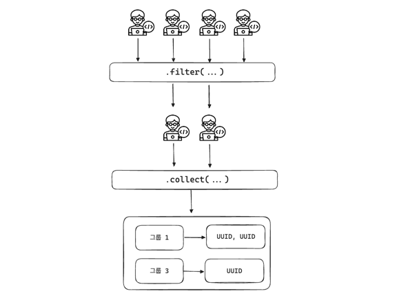
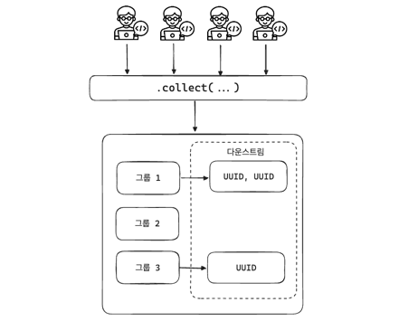
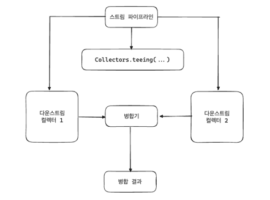

## 컬렉터

컬렉션의 핵심 기능은 다양한 요소를 새로운 자료 구조로 모으는 것이다. 
- List, Set의 경우 `Collection` 기반의 타입을 사용하면 작업이 비교적 간단하다. 
- but, Map의 경우에는 단일 키 값을 가지는 간단한 키-값 매핑일지라도 키 충돌과 같은 문제를 처리해야 한다.
  - 그룹화, 축소, 분할 등 Map의 값을 변경하려면 수집된 값을 효과적으로 조작하는 방법이 필요하다. 
  - 이럴 때에 다운스트림 컬렉터를 사용한다.

---

### 다운스트림 컬렉터
`java.util.stream.Collectors` 팩토리 메서드를 통해 제공되는 일부 컬렉터는 다운스트림 요소를 조작하기 위한 추가적인 컬렉터를 사용할 수 있는데 기본적으로 기본 컬렉터가 작업을 완료한 후 다운스트림 컬렉터가 수집된 값을 추가로 변경한다.

**다운스트림 컬렉터의 일반적인 작업**
- 변환 (transforming)
- 축소 (reducing)
- 평탄화 (flattening)
- 필터링 (filtering)
- 복합 컬렉터 연산 (composite collector operation)

---

### 요소 변환
스트림 요소를 Map으로 그룹화할 때 `Collectors.groupingBy` 메서드를 사용한다.
- 키-값 매핑에서 값 부분이 필요한 형태로 제공되지 않았을 경우 추가 변환이 필요하다.

```java
Map<String, List<User>> lookup = users.stream()
        .collect(Collectors.groupingBy(User::group)); // group을 키로 Map 생성
```

만약 전체 User 정보 대신 id 정보만 필요할 경우
- 요소들을 수집하기 전 중간 Map 연산을 통해 요소를 변환할 수는 없다. -> 실제 User에 접근할 수 없기 때문
- 이 때 수집된 요소를 변환하기 위해 다운스트림 컬렉터를 사용한다.

**groupingBy**
```java
static<T, K, A, D> Collector<T, ?, Map<K, D>> 
        groupingBy(Function<? super T, ? extends K> classifier,
                    Collector<? super T, A, D> downstream)
```
- 첫 번째 매개변수로 분류 함수(classifier)를 받는다. 분류 함수는 스트림의 각 요소를 받아 그룹화의 기준이 될 키를 반환한다.
  - ex) User::group을 classifier로 사용하면 각 User 객체의 group 메서드가 반환하는 값에 따라 사용자들을 그룹화한다.

단순히 그룹화만 할 경우 `Map<K, List<T>>` 타입의 맵이 생성된다. 그룹에 속한 사용자들의 ID만을 수집하고 싶은 경우, 다운스트림 컬렉터를 사용해 요소들을 추가로 변환하고 집계해야 한다.
- User 그룹을 고유한 id 인스턴스 목록에 매핑하는 `Map<String, Set<UUID>>`를 생성해야 한다.


| 제네릭 타입 | 사용법                       |
|--------|---------------------------|
| T      | 수집 전의 스트림 요소 타입           |
| K      | 결과 Map의 키 타입              |
| D      | 다운스트림 컬렉터로 생성된 결과 Map의 타입 |
| A      | 다운스트림 컬렉터의 누적기(공유변수) 타입   |

- classifier는 T 타입의 요소를 키 타입 K로 매핑해 키를 생성한다.
- 다운스트림 컬렉터는 T 타입의 요소를 새로운 결과 타입 D로 집계한다.
- 전체 결과는 Map<K, D>가 된다.


1. User 요소의 id가 필요하다. - 'mapping'을 통한 요소 변환
   - `Collectors.mapping`은 스트림의 각 요소를 원하는 형태로 변환한 후 그 결과를 다른 컬렉터로 넘겨 최종적으로 수집하는 역할을 한다.
        ```java
        Collector<T, ?, R> mapping(Function<? super T, ? extends U> mapper, 
                                    Collector<? super U, A, R> downstream)
        ```
   - 매핑 컬렉터의 주된 목표는 요소들을 매핑하는 것으로 매핑된 요소의 실제 수집은 해당 컬렉터의 범위를 벗어나기 때문에 다운스트림 컬렉터에서 해야한다.

2. Collectors.toSet 메서드를 사용해 매핑된 요소들을 Set으로 만든다.

```java
Map<String, Set<UUID>> lookup = users.stream()
        .collect(Collectors.groupingBy(User::group,
        Collectors.mapping(User::id, Collectors.toSet())));
```

---

### 요소 축소
그룹별 id를 위한 조회 맵을 생성하는 대신 사용자별 logEntries를 계산해보자
- User의 로그 항목 수를 파악하고 최종 합계를 얻어야 한다.

```java
var summingUp = Collectors.reducing(0, Integer::sum);

var downstream = Collectors.mapping((User user) -> user.logEntries().size(), summingUp);

Map<UUID, Integer> logCountPerUserId = user.stream()
        .collect(Collectors.groupingBy(User::id, downstream));
```
1. mapping 컬렉터로 각 User 객체에서 로그 항목 수를 추출
2. 추출한 결과를 reducing 컬렉터로 전달해 합산
3. reducing은 초기값(0), 매핑 함수(`User::logEntries().size()`), 합산을 위한 누적 함수(`Integer::sum`)을 받는다.


**단일 reducing 컬렉터를 사용해 같은 동작을 간결하게 하기**
```java
var downstream = Collectors.reducing(0,         // 초기 값
        (User user) -> user.logEntries().size(),    // 매퍼
        Integser::sum);         // 명령 코드

Map<UUID, Integer> logCountPerUserId = users.stream()
        .collect(Collectors.groupingBy(User::id, downstream));
```
1. 

**`summingInt`를 사용해 성능 최적화하기**
단순히 숫자를 합산하는 경우에는 `java.util.stream.Collectors`가 제공하는 기능을 사용하는 게 성능에 더 좋다.
```java
var downstream = Collectors.summingInt((User user) -> user.logEntries().size());

Map<UUID, Integer> logCountPerUserId = users.stream()
        .collect(Collectors.groupingBy(User::id, downstream));
```
- summing 컬렉터는 원시 타입(int, ...)에 사용할 수 있다.
- 이 외에도 averaging, counting 등을 지원한다.

---

### 컬렉션 평탄화
스트림에서 컬렉션 기반 요소를 처리할 때 대부분 `flatMap`을 사용해 평탄화 작업을 한다. 
- 이렇게 하지 않으면 List<List<String>>처럼 중첩 컬렉션이 생성됨

자바 9부터 평탄화 기능을 내장한 새로운 컬렉터 `flatMapping`이 도입되었다.
```java
static Collector<T, ?, R> flatMapping(Function<T, String<U>> mapper,
                                        Collector<U, A, R> downstream)
```

이를 사용해 logEntires를 그룹에 따라 분류할 때 평탄화 작업을 해보자
- 기존에는 Map<String, List<List<String>> 형태였을 것

```java
var downstream = Collectors.flatMapping((User user) -> 
        user.logEntries.stream(),
        Collectors.toList());

Map<String, List<String>> result = users.stream()
        .collect(Collectors.groupingBy(User::group, downstream));
```
1. 평탄화
    - 각 User 객체의 logEntries를 스트림으로 변환
    - User 객체마다 로그 항목 리스트를 갖고 있으므로 각 리스트가 스트림의 요소로 전환된다.
2. 다운스트림 컬렉터
   - toList()로 평탄화된 스트림을 리스트로 수집한다.
   - 각 그룹별로 모든 로그 항목이 하나의 리스트로 합쳐진다.

이렇게 스트림 파이프라인의 결과 타입이 예상과 다를 경우 `Collectors.mapping`이나 `Collectors.flatMapping` 같은 다운스트림 컬렉터를 사용해 원하는 타입으로 변환할 수 있다.
- mapping 사용 예
  - 스트림의 각 객체에서 특정 필드만 추출할 때
  - 객체를 다른 형태의 객체로 변환할 때
  - 간단한 데이터 변환 후 리스트, 셋, 맵 등으로 수집할 때
- flatMapping 사용 예
  - 스트림의 요소가 리스트 또는 스트림과 같은 컬렉션을 반환하는 경우
  - 중첩된 리스트 또는 스트림을 단일 리스트 또는 셋으로 평탄화할 때
  - 중첩 구조를 단일 수준으로 줄이고 이를 다른 형태로 수집할 때

---

### 요소 필터링
스트림 파이프라인에서 필터링은 filter로 이루어진다. 자바 9부터 필터링 기능을 가진 새 컬렉터 filtering이 도입되어 요소 필터링 단계를 누적 프로세스 앞으로 이동시켰다. 
```java
static <T, A, R> Collector<T, ?, R> filtering(Predicate<T> predicate, 
                                                Collector<T, A, R> downstream)
```

**중간 연산 filter vs 컬렉터 filtering**
```java
var startOfDay = LocalDate.now().atStartOfDay();

// 오늘 로그인한 사람
Predicate<User> loggedInToday = Predicate.not(user -> user.lastLogin().isBefore(startOfDay));

// 중간 연산 filter
Map<String, Set<UUID>> filter = users.stream()
                                        .filter(loggedInToday)
                                        .collect(Collectors.groupingBy(User::group,
                                                                        mapping(User::id, toSet())));

// 컬렉터 filtering
Map<String, Set<UUID>> filter = users.stream()
        .collect(Collectors.groupingBy(User::group,
                                        Collectors.filtering(loggedInToday,
                                            mapping(User::id, toSet()))));
```

두 연산은 필터링 순서가 달라서 결과가 달라질 수 있다. 

**중간 연산 filter의 연산 과정**
오늘 로그인한 사용자만 필터링해 맵에 포함시키고, 그룹화를 진행한다. 


**먼저 그룹화한 후 다운스트림에서 filtering하기**
groupingBy 컬렉터는 마지막 로그인 날짜와 상관없이 모든 User 요소에 접근하고, 다운스트림 컬렉터인 filtering을 통해 오늘 로그인한 사용자만 필터링한다.



상황에 따라 효율적인 방법을 선택하자

---

### 합성 컬렉터
`Collectors.teeing`은 한 번에 두 개의 다운 스트림 컬렉터를 동시에 처리하고 그 결과를 하나로 통합하는 연산이다. 먼저 두 다운스트림 컬렉터를 통과한 후 `BiFunction`을 이용해 두 결과를 하나로 합친다.


`teeing`은 3개의 파라미터를 받는다.
1. 첫 번째 컬렉터
2. 두 번째 컬렉터
3. 결과 병합(BiFunction) : 첫 번째와 두 번째 컬렉터 결과를 받아 최종 결과 생성

**전체 사용자 수와 그 중 한 번도 로그인하지 않은 사용자 수를 알고 싶은 경우**
- 전체 사용자 수를 세기 위한 한 번의 순회와 로그인 한 적 없는 사용자를 세기 위한 한 번의 순회, 총 2번의 순회가 필요하다.
- 두 개의 카운팅 작업은 `counting`과 `filtering` 같은 전용 컬렉터로 나타낼 수 있으므로 데이터를 한 번만 순회하게 할 수 있다.
- `teeing`을 통해 파이프라인 끝에서 두 개의 카운팅 작업을 수행하도록 하면 한번의 순회로 끝나는 것이다.
- 최종 결과는 `Bifunction<Long, Long>`을 사용해 새로운 자료 구조 `UserStats`에 병합된다.
```java
// 결과 타입으로 record를 사용하느 ㄴ이유는 자바가 동적 튜플을 지원하지 않기 때문
record UserStats(long total, long neverLoggedIn) {
    // 바디 생략
}

List<User> users = List.of(
        new User("user1", LocalDate.now()),  // 오늘 로그인함
        new User("user2", null),             // 로그인하지 않음
        new User("user3", null),             // 로그인하지 않음
        new User("user4", LocalDate.now().minusDays(1))  // 어제 로그인함
);

UserStats result = users.stream()
        .collect(Collectors.teeing(Collectors.counting(),   // 모든 요소의 수 카운팅 
                Collectors.filtering(user -> user.lastLogin() == null,  // 로그인을 한번도 하지 않은 사용자를
                        Collectiors.counting()),                        // 카운팅
                UserStats::new));

// 결과
// UserStats(total=4, neverLoggedIn=2)
```
